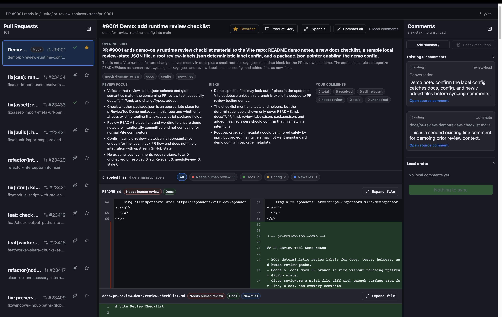

# PR Review Tool

Local-first Electron workspace for reviewing GitHub pull requests without losing reviewer context.

The app is aimed at leads who spend a lot of time switching between repos, PRs, comments, and review state. It opens PRs into local git worktrees, shows the diff against the base branch, lets reviewers leave local draft comments, and syncs those comments to GitHub when they are ready.



## What It Does

- Saves multiple local repositories and opens to a home dashboard.
- Lists real GitHub PRs for a repo, with mock/demo PR support for demos.
- Favorites PRs for one-click access from the home page.
- Checks out each PR in a separate local worktree.
- Shows split diffs with deterministic review labels.
- Supports file expansion for more context around hunks.
- Lets reviewers add line, block, and summary comments locally.
- Shows existing GitHub PR comments beside local drafts.
- Syncs local comments and deletions back to GitHub.
- Tracks whether existing local review comments are still relevant with local Codex.
- Builds an optional Product Story preflight before review.
- Supports dark mode, path obfuscation, resizable sidebars, and fully collapsed side panels.

## Product Story

Product Story is a click-through preflight for understanding a PR before reviewing the diff. It uses local Codex on demand, or via the PR preload button, to produce a short guided walkthrough:

1. What changed
2. Why it changed
3. What behavior is affected
4. What code path matters
5. What is risky
6. What evidence exists
7. What prior agent/comment context matters
8. Where the human should inspect

Slides can include exact code fragments and `Open Diff` targets so the reviewer can jump from explanation to the relevant file.

Optional repo-specific guidance can live in:

- `.pr-review-tool/pr-story-guide.md`
- `.pr-review-tool/review-guide.md`
- `PR_REVIEW_GUIDE.md`

See [docs/pr-story-guide.md](docs/pr-story-guide.md).

## Separate Labeler Package

The deterministic labeler is intentionally separate from this Electron app:

- Repository: [axeggW/review-labeler](https://github.com/axeggW/review-labeler)
- Dependency: `@pr-review-tool/review-labeler`
- CLI bin: `review-labeler`

This app consumes it as a package dependency:

```json
"@pr-review-tool/review-labeler": "github:axeggW/review-labeler"
```

The labeler supports file rules from `review-labels.json` and inline source markers for code chunks, such as:

```ts
// review-labeler: needs-human-review function classifyTransaction
function classifyTransaction(transaction) {
  return transaction
}
```

## Prerequisites

- Node.js
- npm
- Git
- GitHub CLI: `gh`
- Authenticated GitHub CLI: `gh auth login`
- Local Codex CLI for Product Story and comment-resolution checks

The app can still open repos without Codex, but AI preload, Product Story, and resolution checks require `codex`.

## Setup

```sh
npm install
npm run dev
```

If the default Vite port is busy, Electron will choose the next available port.

## Scripts

```sh
npm run dev
npm run typecheck
npm run build
npm run preview
npm run demo:seed
```

`npm run demo:seed` creates local demo repositories under `.demo-repos/`. That directory is ignored by git.

## Review Flow

1. Open the app.
2. Choose a local git repo, or select a saved repo from Home.
3. Open a PR from the sidebar or a favorite PR from Home.
4. Optionally click the sparkles preload button to warm the opening brief and Product Story.
5. Review the opening brief, labels, existing comments, and diff.
6. Add local line, block, or summary comments.
7. Check comment resolution when revisiting a PR.
8. Sync drafts and deletions to GitHub.

## Current Scope

This is v1/demo-grade. GitHub is the first-class provider, via `gh` and GitHub API calls. The app is designed so other git providers or review backends can be added later, but the current end-to-end sync path targets GitHub.
